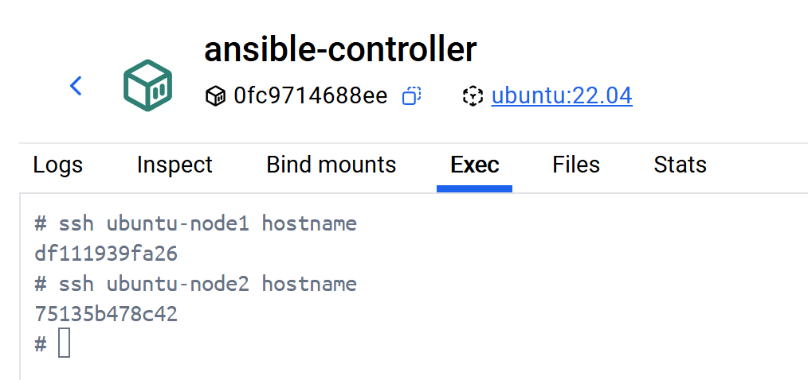
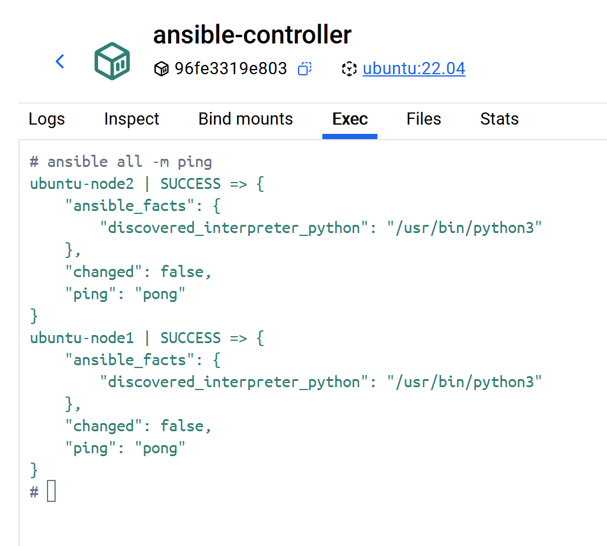
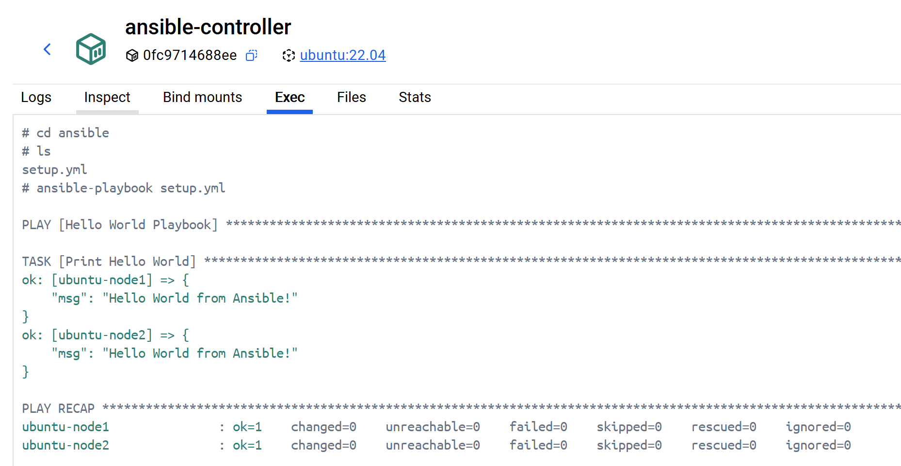

# Ansible-Deep-Dives

# Ansible Tutorial
[Tutorial Content](./Ansible-Tutorial/context.md)

# Instructions for Starting the Ansible Lab Environment
Follow the steps below to launch the lab environment and verify SSH connectivity to the managed nodes.

### 1. Navigate to the Lab Directory
Move into the project’s ansible-lab folder:
```
cd /D/GitHub-Progressive_Pull/Ansible-Deep-Dives/ansible-lab
```

### 2. Start the Lab Environment
Use Docker Compose to bring up all containers:

``` bash
docker compose up
```
This will start the controller and both Ubuntu nodes.

###  3. Verify SSH Access to Each Node
Once the containers are running, test SSH connectivity.

Connect to ubuntu-node1:
```bash
ssh ubuntu-node1 hostname
```
Connect to ubuntu-node2:
```bash
ssh ubuntu-node2 hostname
```


If the connection succeeds, each command will return the hostname of the container.

# SSH Warning: Remote Host Identification Has Changed

You may see:
```
@@@@@@@@@@@@@@@@@@@@@@@@@@@@@@@@@@@@@@@@@@@@@@@@@@@@@@@@@@@
@    WARNING: REMOTE HOST IDENTIFICATION HAS CHANGED!     @
@@@@@@@@@@@@@@@@@@@@@@@@@@@@@@@@@@@@@@@@@@@@@@@@@@@@@@@@@@@
IT IS POSSIBLE THAT SOMEONE IS DOING SOMETHING NASTY!
Someone could be eavesdropping on you right now (man-in-the-middle attack)!
It is also possible that a host key has just been changed.
The fingerprint for the ED25519 key sent by the remote host is
SHA256:XSbgi7gYYes89E8LojcWtphaW3O+3SbsJSjWVu5z9VM.
Please contact your system administrator.
Add correct host key in /root/.ssh/known_hosts to get rid of this message.
Offending ED25519 key in /root/.ssh/known_hosts:1
  remove with:
  ssh-keygen -f "/root/.ssh/known_hosts" -R "ubuntu-node1"
Host key for ubuntu-node1 has changed and you have requested strict checking.
Host key verification failed.
```

### Why This Happens
This warning is normal when rebuilding containers.      

Each time Docker recreates **ubuntu-node1**, it generates a **new SSH host key**.
Your controller still has the old fingerprint stored in **~/.ssh/known_hosts**, so SSH detects a mismatch and warns you.

You're not being attacked — your controller simply remembers a previous container instance.

### ✅ Fix: Remove the Old Host Key

Inside the ansible-controller container, run:   

```
ssh-keygen -f "/root/.ssh/known_hosts" -R "ubuntu-node1"
```

OR
```
ssh-keygen -f "/root/.ssh/known_hosts" -R "ubuntu-node2"
```

Then try connecting again:
```
ssh ubuntu-node1 hostname
ssh ubuntu-node2 hostname
```

# ✅Test 

Inside the controller:

`` bash
ansible all -m ping
`` 
Or target a single host:

`` bash
ansible ubuntu-node1 -m ping
`` 
You should now see:

`` Code
ubuntu-node1 | SUCCESS => {
    "changed": false,
    "ping": "pong"
}
``




# Instructions: Connecting to ubuntu-node2 for the First Time

When you SSH into a new host for the first time, SSH does not yet have the server’s fingerprint stored. You’ll see a message like this:

``` bash
# ssh ubuntu-node2 hostname
The authenticity of host 'ubuntu-node2 (172.18.0.2)' can't be established.
ED25519 key fingerprint is SHA256:+c0wE57TdtBDKHnAvXJccQCAQVogJZtCiLarM4eo/q4.
This key is not known by any other names
Are you sure you want to continue connecting (yes/no/[fingerprint])?
```
### ✅ What You Should Do
1. **Verify that you're connecting to the correct host**  
Since this is a fresh container or a new VM, it’s normal that SSH hasn’t seen this key before.

2. **Type yes to trust the host key**  
SSH will add the fingerprint to your ~/.ssh/known_hosts file.

SSH will confirm the key was saved  
You’ll see:
```
Warning: Permanently added 'ubuntu-node2' (ED25519) to the list of known hosts.
```

4. **The command will then run normally, for example:**
```
d93062811947
```

# Hello World Playbook
Here’s a clean, minimal “Hello World” Ansible playbook you can drop directly into your /ansible folder and run with ansible-playbook.

### ▶️ How to run it
Inside your Ansible controller container:

``` bash
cd /ansible
ansible-playbook setup.yml
```
### 🎯 Expected output

```
PLAY [Hello World Playbook] ****************************************************

TASK [Print Hello World] *******************************************************
ok: [ubuntu-node1] => {
    "msg": "Hello World from Ansible!"
}
ok: [ubuntu-node2] => {
    "msg": "Hello World from Ansible!"
}

PLAY RECAP *********************************************************************
ubuntu-node1 : ok=1 changed=0
ubuntu-node2 : ok=1 changed=0
```



---

# References
* [Ansible Official Website - RedHat](https://www.redhat.com/en/ansible-collaborative)
* [diveinto playground](https://diveinto.com/p/playground)
* [diveintoansible](https://github.com/spurin/diveintoansible)
* [diveintoansible-lab](https://github.com/spurin/diveintoansible-lab)
* [devops-master-class](https://github.com/in28minutes/devops-master-class)
* [ansible-training-answer-keys-2](https://github.com/mmumshad/ansible-training-answer-keys-2)
* [Getting started with Ansible | Learn Linux TV | YouTube](https://www.youtube.com/playlist?list=PLT98CRl2KxKEUHie1m24-wkyHpEsa4Y70)
* [Ansible | Jim's Garage| YouTube](https://www.youtube.com/playlist?list=PLXHMZDvOn5sW-EXm2Ur5TroSatW-t0Vz_)


